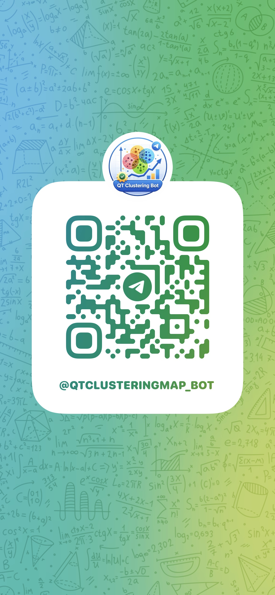
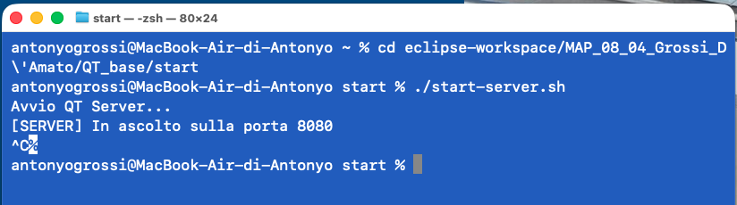
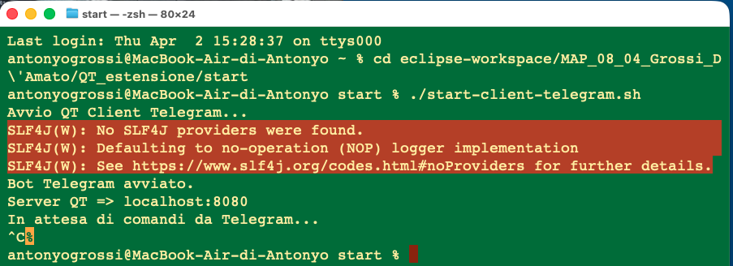
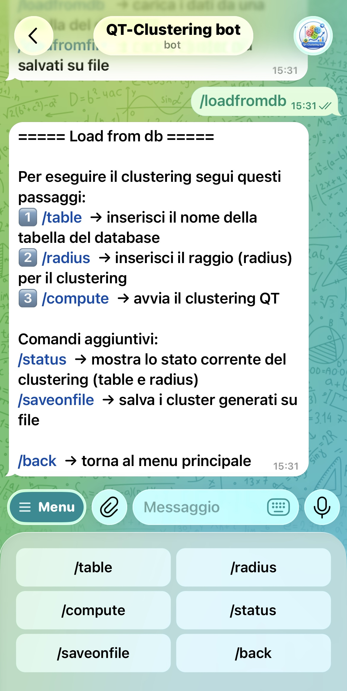
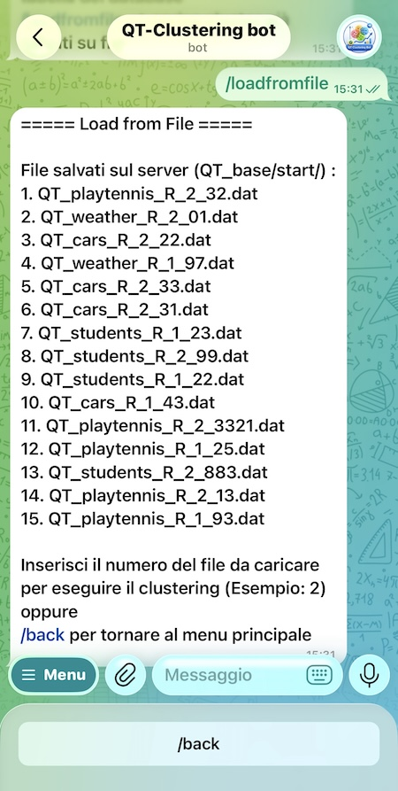

# Guida Utente – Estensione progetto ClientTelegram

# Indice

1. [Introduzione](#1-introduzione)  
2. [Accesso al bot Telegram](#2-accesso-al-bot-telegram)  
3. [Scelte progettuali](#3-scelte-progettuali)  
   - [3.1 Bot Telegram come client separato](#31-bot-telegram-come-client-separato)  
   - [3.2 Riuso del server e del protocollo](#32-riuso-del-server-e-del-protocollo)  
   - [3.3 Gestione di più utenti con un solo processo](#33-gestione-di-più-utenti-con-un-solo-processo)  
   - [3.4 Connessione client-server on-demand](#34-connessione-client-server-on-demand)  
   - [3.5 Uso di `static` e `final`](#35-uso-di-static-e-final)
4. [Requisiti di sistema](#4-requisiti-di-sistema)  
5. [Avvio del sistema](#5-avvio-del-sistema)  
   - [5.1 Avvio del database MySQL](#51-avvio-del-database-mysql)  
   - [5.2 Avvio del server QT](#52-avvio-del-server-qt)  
   - [5.3 Avvio del Client Telegram](#53-avvio-del-client-telegram)  
   - [5.4 Avvio del bot Telegram](#54-avvio-del-bot-telegram)  
   - [5.5 Terminazione dei processi](#55-terminazione-dei-processi) 
6. [Comandi disponibili](#6-comandi-disponibili)  
   - [6.1 Menu principale](#61-menu-principale)  
   - [6.2 Modalità database](#62-modalità-database)  
   - [6.3 Modalità file](#63-modalità-file)  
7. [Utilizzo del bot](#7-utilizzo-del-bot)  
   - [7.1 Avvio e menu principale](#71-avvio-e-menu-principale)  
   - [7.2 Caricamento da database](#72-caricamento-da-database)  
   - [7.3 Caricamento da file](#73-caricamento-da-file)  
8. [Gestione della sessione](#8-gestione-della-sessione)  
9. [Interpretazione dei risultati](#9-interpretazione-dei-risultati)  
10. [Errori comuni e soluzioni](#10-errori-comuni-e-soluzioni)  
   - [10.1 Checklist rapida di verifica](#101-checklist-rapida-di-verifica)  
11. [Note finali](#11-note-finali)  
12. [Conclusione](#12-conclusione)  

---

# 1. Introduzione
Questa guida descrive l’utilizzo del **ClientTelegram**, estensione del progetto base di clustering QT.

A differenza del client testuale, l’interazione con il sistema avviene tramite un **bot Telegram**, che consente di:
- eseguire il clustering QT
- visualizzare lo stato della sessione
- salvare i risultati su file
- caricare cluster già salvati

Il bot comunica con il server QT utilizzando lo **stesso protocollo client-server** del progetto base, senza modificare il server.

Per iniziare, è sufficiente aprire la chat del bot e premere `/start`.

---

# 2. Accesso al bot Telegram
Il bot può essere raggiunto in due modi:

- tramite link diretto: [QTClusteringMAP_bot](https://t.me/QTClusteringMAP_bot)
- tramite QR code

---

# 3. Scelte progettuali

L’estensione è stata realizzata **solo lato client**, lasciando invariato il server QT del progetto base. Il bot Telegram è stato quindi progettato come **nuovo client** del sistema, capace di comunicare con il server tramite socket TCP e usando lo stesso protocollo del client testuale. Questa scelta permette di mantenere l’architettura client-server originale senza modificare la logica del server. 

## 3.1 Bot Telegram come client separato
Il bot non è stato integrato nel server, ma sviluppato come componente autonomo. In questo modo:
- il server continua a occuparsi solo del clustering e della gestione dei dati
- il client Telegram gestisce solo l’interazione con l’utente
- il sistema resta più coerente con il progetto base

Questa soluzione è architetturalmente preferibile rispetto a inserire il bot direttamente nel server, perché mantiene separati i ruoli dei componenti e rende il server riutilizzabile anche da altri client. :contentReference[oaicite:1]{index=1}

## 3.2 Riuso del server e del protocollo
Il server del progetto base era già completo e testato. Per questo motivo si è scelto di **riutilizzarlo senza modifiche**, sfruttando lo stesso protocollo di comunicazione già esistente. Il client Telegram si limita quindi a tradurre i comandi dell’utente nelle richieste previste dal server. Questo evita duplicazioni di logica e rende il sistema più stabile e manutenibile.

## 3.3 Gestione di più utenti con un solo processo
Un vantaggio importante del bot Telegram è la possibilità di gestire **più chat contemporaneamente** pur avendo un solo processo client attivo. Questo è possibile perché ogni conversazione viene identificata tramite `chatId` e associata a una propria `UserSession`, che conserva lo stato dell’interazione. In questo modo i dati e i comandi di utenti diversi restano separati e non interferiscono tra loro.

## 3.4 Connessione client-server on-demand
La connessione verso il server non viene aperta all’avvio del bot, ma **solo quando serve davvero**, ad esempio durante `/compute` o nel caricamento effettivo di un file. I comandi preliminari, come `/table` e `/radius`, servono solo a raccogliere dati lato client. Questa scelta riduce connessioni inutili, evita spreco di risorse e rende l’interazione più efficiente. Nel flusso `/loadfromdb` la connessione può restare attiva per consentire anche `/saveonfile`, mentre in `/loadfromfile` viene usata in modo temporaneo.

## 3.5 Uso di `static` e `final`
Nel progetto sono stati usati diversi `static` e `final` per rendere il codice più chiaro e coerente.

I `static` sono stati utilizzati soprattutto nelle classi di utilità, come `TelegramMenu`, `TelegramSender` e `FileManager`, perché queste classi non mantengono stato interno ma forniscono solo metodi di supporto. Sono inoltre `static` anche alcune costanti condivise, come gli stati della sessione in `UserSession` e i parametri di configurazione in `BotMain`.

I `final`, pur non essendo sempre la scelta più flessibile in Java, sono stati usati nei punti in cui era importante esprimere chiaramente che un valore non deve cambiare:
- nei parametri di configurazione del bot (`BOT_TOKEN`, `SERVER_HOST`, `SERVER_PORT`, ecc.)
- nel riferimento alla mappa delle sessioni in `BotMain`
- nei campi della classe `ClusterFileInfo`, che rappresenta un piccolo oggetto dati immutabile
- nelle costanti che definiscono gli stati ammessi della sessione

In questo progetto, quindi, `final` è stato usato non per rigidità, ma per migliorare la leggibilità del codice, evitare modifiche accidentali e rendere più esplicite le scelte progettuali.

---

# 4. Requisiti di sistema
Per utilizzare il ClientTelegram sono necessari:

- Java JDK 17 o superiore
- Server QT attivo (porta 8080 disponibile)
- MySQL attivo (solo per modalità database)
- Connessione Internet attiva
- Bot Telegram configurato

---

# 5. Avvio del sistema
Per utilizzare il bot è necessario avviare correttamente tutti i componenti del sistema.

## 5.1 Avvio del database MySQL

Per utilizzare il sistema è necessario avviare il server MySQL ed eseguire lo script di inizializzazione del database.

#### Avvio del server MySQL

A seconda del sistema operativo:

**macOS (Homebrew):** `brew services start mysql`
oppure: `mysql.server start`

**Windows:**
- Aprire *Servizi* (services.msc)
- Avviare il servizio **MySQL** oppure **MySQL80**

In alternativa da terminale: `net start MySQL80`

#### Accesso a MySQL

Aprire il terminale ed eseguire:
`mysql -u root -p`

Inserire la password quando richiesta.

---

#### Esecuzione dello script SQL

Una volta entrati nella console MySQL, eseguire:
`source QT_estensione/start/setup_mapdb_estensione.sql;`

---

#### Cosa fa lo script

Lo script:

- crea il database **MapDB**
- crea le tabelle:
  - `playtennis`
  - `cars`
  - `weather`
  - `students`
- inserisce i dati necessari per il clustering

---

#### Verifica

`SHOW DATABASES;`

`USE MapDB;`

`SHOW TABLES;`

Se compaiono le tabelle sopra indicate, il database è stato configurato correttamente.

---

### 5.2 Avvio del server QT

Avviare il server del progetto base tramite:

**Linux / macOS:**

`QT_base/start/start-server.sh`

**Windows:**

`QT_base/start/start-server.bat`

Esempio di output atteso:

Il server rimane in ascolto sulla porta **8080**.

---

### 5.3 Avvio del Client Telegram

Aprire un nuovo terminale e avviare il client Telegram:

**Linux / macOS:**

`QT_estensione/start/start-client-telegram.sh`

**Windows:**

`QT_estensione/start/start-client-telegram.bat`

Esempio di output:

#### ⚠️ Nota sui warning

Durante l’avvio possono comparire i seguenti warning:

`SLF4J: No SLF4J providers were found`

`SLF4J: Defaulting to no-operation (NOP) logger implementation`

Questi messaggi **non compromettono il funzionamento del sistema** e sono dovuti alla mancanza di una configurazione esplicita del logger.

Il client continuerà a funzionare correttamente.

---

### 5.4 Avvio del bot Telegram

Una volta avviati server e client, accedere al bot Telegram come descritto nella sezione:

👉 [Accesso al bot Telegram](#2-accesso-al-bot-telegram)

Premere `/start` per iniziare l'interazione.

---

### 5.5 Terminazione dei processi

Per terminare l’esecuzione sia del server QT che del Client Telegram è sufficiente utilizzare la combinazione di tasti:
`CTRL + C`

Questa operazione interrompe il processo attivo nel terminale.

> ⚠️ Nota:  
> È necessario eseguire questa operazione separatamente per ogni terminale in cui sono stati avviati il server e il client.

---

# 6. Comandi disponibili
- `/start` → avvia il bot

## 6.1 Menu principale
- `/loadfromdb` → modalità database
- `/loadfromfile` → modalità file

## 6.2 Modalità database
- `/table` → inserimento nome tabella
- `/radius` → inserimento raggio
- `/compute` → esegue clustering
- `/status` → mostra parametri correnti
- `/saveonfile` → salva clustering su file
- `/back` → ritorna al menu principale

## 6.3 Modalità file
- selezione numerica del file mostrato dal bot
- `/back` → ritorna al menu principale

---

# 7. Utilizzo del bot

## 7.1 Avvio e menu principale
Dopo il comando `/start`, il bot mostra il **menu principale**, da cui è possibile scegliere se caricare i dati da database oppure da file salvati.

---

## 7.2 Caricamento da database
Per eseguire il clustering a partire da una tabella del database, seguire questa sequenza:

1. `/loadfromdb`
2. `/table`
3. inserire il nome della tabella
4. `/radius`
5. inserire un valore numerico maggiore di 0
6. `/compute`

Comandi opzionali:
- `/status` → visualizza lo stato corrente della sessione
- `/saveonfile` → salva il clustering su file nella cartella `QT_base/start` (lato server)
- `/back` → torna al menu principale

📌 La connessione al server viene aperta al momento di `/compute`.

📌 Il file generato viene salvato lato server e sarà successivamente disponibile nella modalità `/loadfromfile`.

Esempio di schermata del menu database:

---

## 7.3 Caricamento da file
Per caricare un clustering già salvato:

1. `/loadfromfile`
2. il bot mostra la lista dei file disponibili sul server
3. inserire il **numero** corrispondente al file da caricare
4. il bot restituisce il clustering richiesto
5. usare `/back` per tornare al menu principale

📌 In questa modalità la connessione è temporanea, perché ogni caricamento è un’operazione indipendente.

Esempio di schermata del menu file:

---

# 8. Gestione della sessione

Ogni chat Telegram è associata a una **sessione indipendente**, che permette al bot di gestire più utenti contemporaneamente senza mescolare dati e comandi tra conversazioni diverse.

Per ogni utente, il sistema mantiene una sessione che contiene:
- il nome della tabella selezionata
- il valore del raggio (`radius`)
- lo stato dell’interazione, cioè l’informazione che il bot sta aspettando in quel momento
- un’eventuale connessione attiva al server QT
- la lista dei file disponibili nel flusso di caricamento da file

Lo **stato dell’interazione** serve a guidare correttamente l’utente durante l’uso del bot. Ad esempio:
- dopo il comando `/table`, il bot attende il nome della tabella
- dopo il comando `/radius`, il bot attende un valore numerico
- durante `/loadfromfile`, il bot attende il numero corrispondente al file da caricare

Comportamenti importanti:
- `/back` resetta la sessione corrente e riporta al menu principale
- i parametri inseriti non vengono mantenuti dopo l’uscita dal menu database
- le sessioni di utenti diversi non interferiscono tra loro

Questo rende possibile gestire **più utenti contemporaneamente** pur avendo un solo processo del bot attivo.
---

# 9. Interpretazione dei risultati
Il clustering restituito contiene:

- **Number of Clusters** → numero di cluster trovati
- **Centroid** → centro del cluster
- **Examples** → elementi appartenenti al cluster
- **dist** → distanza di ciascun elemento dal centroide
- **AvgDistance** → distanza media del cluster

Queste informazioni permettono di valutare la struttura dei cluster generati e la loro compattezza.

---

# 10. Errori comuni e soluzioni

Di seguito sono riportati i principali errori che possono verificarsi durante l’utilizzo del sistema, insieme alle possibili soluzioni.

---

### Server non attivo
**Errore:** il bot segnala un errore di connessione durante l’esecuzione di `/compute` o altre operazioni.

**Causa:** il server QT non è avviato.

**Soluzione:**
- verificare che il server sia in esecuzione
- controllare che la porta **8080** sia libera
- riavviare il server tramite `start-server.sh` o `start-server.bat`

---

### MySQL non attivo
**Errore:** errore durante il caricamento da database (SQL error o connection failure).

**Causa:** il server MySQL non è avviato.

**Soluzione:**
- avviare MySQL (es. `brew services start mysql` su macOS oppure servizio MySQL su Windows)
- verificare che le credenziali siano corrette

---

### Tabella inesistente o non valida
**Errore:** il bot non riesce a caricare i dati o segnala errore SQL.

**Causa:** nome tabella errato o non presente nel database.

**Soluzione:**
- verificare il nome inserito con `/table`
- controllare le tabelle disponibili con:
- `SHOW TABLES;`
- assicurarsi di aver eseguito lo script `setup_mapdb_estensione.sql`

---

### Radius non valido
**Errore:** il bot rifiuta il valore inserito.

**Causa:** il valore del raggio non è numerico o è minore/uguale a 0.

**Soluzione:**
- inserire un numero valido maggiore di 0
- evitare caratteri non numerici

---

### Selezione file non valida
**Errore:** il bot segnala input non valido nella modalità `/loadfromfile`.

**Causa:** numero fuori intervallo o input non numerico.

**Soluzione:**
- inserire un numero presente nella lista mostrata
- evitare lettere o simboli

---

### Comando non valido nel contesto corrente
**Errore:** il bot segnala che il comando non è ammesso.

**Causa:** il comando è stato utilizzato nel menu sbagliato.

**Soluzione:**
- seguire la sequenza corretta dei comandi
- usare `/back` per tornare al menu principale

---

### Nessuna connessione attiva
**Errore:** uso di `/saveonfile` senza aver eseguito `/compute`.

**Causa:** non è stata ancora creata una connessione al server.

**Soluzione:**
- eseguire prima `/compute`
- poi utilizzare `/saveonfile`

---

### Warning SLF4J all’avvio
**Messaggio:**

`SLF4J: No SLF4J providers were found`

`SLF4J: Defaulting to no-operation (NOP) logger implementation`

**Causa:** mancanza di una configurazione del sistema di logging.

**Soluzione:**
- nessuna azione necessaria
- il sistema funziona correttamente anche in presenza del warning

---

## 10.1 Checklist rapida di verifica

Prima di utilizzare il bot, verificare rapidamente i seguenti punti:

- ✔ Il server QT è attivo (porta 8080 in ascolto)
- ✔ MySQL è attivo (solo per modalità `/loadfromdb`)
- ✔ Lo script `setup_mapdb_estensione.sql` è stato eseguito correttamente
- ✔ Le tabelle (`playtennis`, `cars`, `weather`, `students`) sono presenti nel database
- ✔ Il ClientTelegram è avviato
- ✔ Il bot Telegram è raggiungibile e risponde al comando `/start`
- ✔ È stata seguita la sequenza corretta dei comandi (`/table`, `/radius`, `/compute`)

Se uno di questi punti non è soddisfatto, il sistema potrebbe non funzionare correttamente.

---

# 11. Note finali
- Il salvataggio su file avviene sul server, nella directory prevista dal progetto base
- I file caricabili devono rispettare il formato previsto dal sistema
- La connessione al server è gestita automaticamente dal bot
- Il bot è progettato per un utilizzo semplice e guidato tramite menu
- La modalità database e la modalità file hanno comportamenti diversi nella gestione della connessione:
  - in `/loadfromdb` la connessione viene aperta a `/compute` e può restare attiva per permettere `/saveonfile`
  - in `/loadfromfile` ogni richiesta è autonoma e usa una connessione temporanea

---

# 12. Conclusione
Il ClientTelegram rappresenta un’interfaccia moderna e intuitiva per il sistema QT, permettendo di utilizzare le funzionalità principali del progetto tramite un semplice bot Telegram, senza necessità di usare il client testuale.

L’estensione mantiene l’architettura client-server del progetto base e rende il sistema più accessibile, pur lasciando invariata la logica del server.
