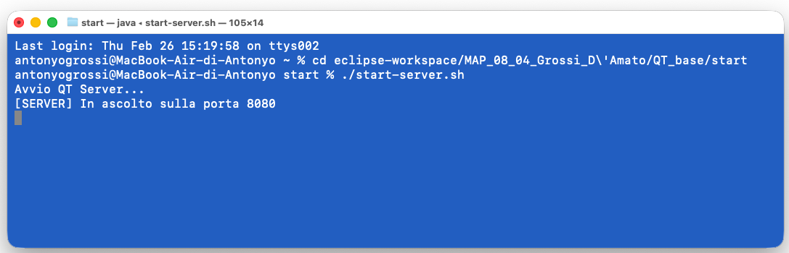
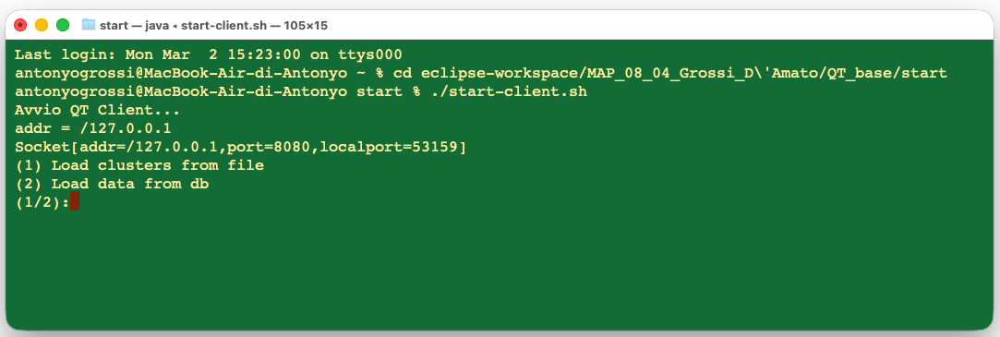
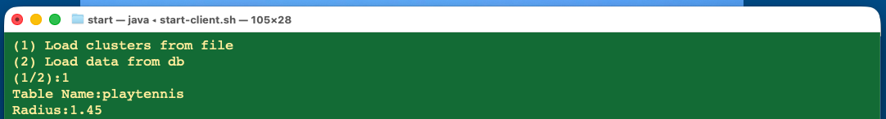
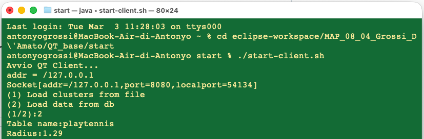
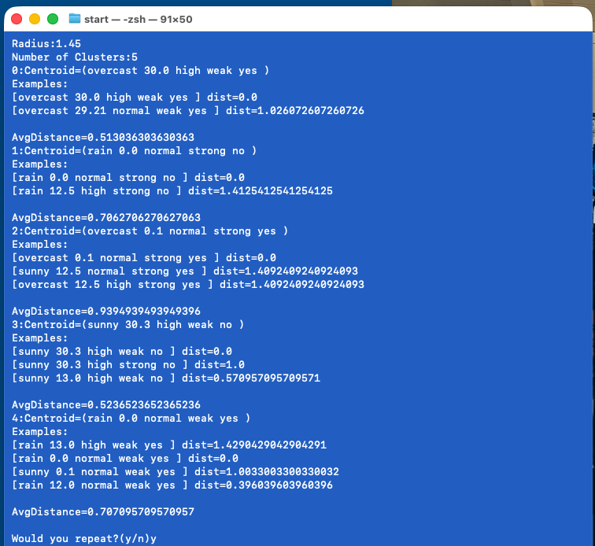

# Manuale Utente
## Sistema di Clustering QT su Database MySQL (Architettura Client–Server)
------------------------------------------------------------------------

# Indice

1. [Introduzione](#1-introduzione)  
2. [Requisiti di Sistema](#2-requisiti-di-sistema)
   - [2.1 Configurazione del Database](#21-Configurazione-del-Database)
3. [Struttura del Sistema](#3-struttura-del-sistema)  
4. [Modalità di Avvio](#4-modalità-di-avvio)  
   - [4.1 Avvio su Windows](#41-avvio-su-windows)  
   - [4.2 Avvio su macOS / Linux](#42-avvio-su-macos--linux)  
5. [Utilizzo del Client](#5-utilizzo-del-client)  
   - [5.1 Caricamento da File](#51-caricamento-da-file-load-clusters-from-file)  
   - [5.2 Caricamento da Database](#52-caricamento-da-database-load-data-from-db)
   - [5.3  Ritorno al menu o uscita dal programma](#53-Ritorno-al-menu-o-uscita-dal-programma)
6. [Interpretazione dei Risultati](#6-interpretazione-dei-risultati) 
7. [Arresto del Server](#7-arresto-del-server)
8. [Risoluzione dei Problemi](#8-risoluzione-dei-problemi)
   - [8.1 Errori di connessione e avvio](#81-errori-di-connessione-e-avvio)
   - [8.2 Errori database](#82-errori-database)
   - [8.3 Errori di inserimento input utente](#83-errori-di-inserimento-input-utente)
   - [8.4 Errori di clustering](#84-errori-di-clustering)
   - [8.5 Errori di caricamento da file](#85-errori-di-caricamento-da-file)

------------------------------------------------------------------------

# 1. Introduzione

Il sistema implementa un sistema **Client–Server** per l’esecuzione dell’algoritmo di clustering QT (Quality Threshold).

Il **Server**: 
- Gestisce le connessioni multiple dei client tramite multithreading
- Si connette a un database MySQL
- Esegue il clustering
- Salva e carica cluster da file

Il **Client**: 
  - Permette all’utente di:
    - Caricare dati dal database
    - Eseguire clustering con raggio variabile
    - Salvare cluster su file
    - Ricaricare cluster da file

------------------------------------------------------------------------

# 2. Requisiti di Sistema

Per eseguire il sistema è necessario:

-   Java JDK 17 o superiore
-   MySQL Server installato e attivo (per modalità database)
-   Driver MySQL Connector presente nella cartella `Server/libs/`

Requisiti di Rete

- Il **Client** e il **Server** devono poter comunicare sulla rete.
- Se eseguiti sulla stessa macchina, è sufficiente utilizzare `localhost` (IP 127.0.0.1).
- La porta **8080** deve essere libera sul computer in cui viene avviato il Server, affinché possa mettersi in ascolto delle connessioni in ingresso.
     - ⚠ Se la porta 8080 è già occupata, il Server non potrà avviarsi correttamente.

Sistemi operativi supportati:

-   Windows
-   macOS
-   Linux

## 2.1 Configurazione del Database

Prima di utilizzare la modalità di apprendimento da database, è necessario configurare il database MySQL.

1. Avviare MySQL Server.
2. Aprire un client MySQL (MySQL Workbench o terminale).
3. Eseguire lo script `mapDB.sql` presente nel progetto.

Esempio da terminale:
`mysql -u root -p < mapDB.sql`

Lo script crea:
- Il database necessario
- Le tabelle richieste
- I dati di esempio utilizzati dal sistema

⚠ Senza l’esecuzione di `mapDB.sql`, la modalità database non funzionerà correttamente.

------------------------------------------------------------------------

# 3. Struttura del Sistema

Il sistema è organizzato nei seguenti package:

-   `server` → Gestione connessioni client
-   `mining` → Algoritmo di clustering
-   `data` → Rappresentazione del dataset
-   `database` → Accesso al database

------------------------------------------------------------------------

# 4. Modalità di Avvio

⚠ Il server deve essere avviato prima del client.

------------------------------------------------------------------------

## 4.1 Avvio su Windows

1.  Aprire la cartella `start` da interfaccia
2.  Eseguire:
    start-server.bat

3.  Successivamente eseguire:
    start-client.bat

In alternativa da Prompt dei comandi:
- per il server : `start-server.bat`
- per i client : `start-client.bat`

------------------------------------------------------------------------

## 4.2 Avvio su macOS / Linux

Aprire il terminale nella cartella `start` ed eseguire:
    `chmod +x start-server.sh`
    `chmod +x start-client.sh`

Avvio server:
    `./start-server.sh`

Avvio client:
    `./start-client.sh`

Esempio avvio server :

------------------------------------------------------------------------

# 5. Utilizzo del Client

Una volta avviato il client, viene mostrato un menu con **2 opzioni**:

- **(1) Load clusters from file**
- **(2) Load data from db**

---

## 5.1 Caricamento da File (Load clusters from file)

Consente di caricare e visualizzare cluster **già salvati in precedenza**.

**Procedura:**
1. Selezionare l'opzione `1` (**Load clusters from file**).
2. Inserire:
   - **Table Name** (nome della tabella)
   - **Radius** (raggio usato quando i cluster sono stati salvati)

Se non esiste un file di clustering corrispondente alla coppia **(tabella, raggio)**, il server restituisce un messaggio di errore e l’operazione non va a buon fine.

---

## 5.2 Caricamento da Database (Load data from db)

Consente di caricare i dati da una tabella MySQL ed eseguire il clustering QT.

**Procedura:**
1. Selezionare l'opzione `2` (**Load data from db**).
2. Inserire:
   - **Table name** (nome della tabella)
   - Inserire il **Radius** per eseguire il clustering.

Il sistema mostra:
- il **numero di cluster** trovati (`Number of Clusters: ...`)
- la **descrizione dei cluster** (centroid, esempi, distanze, AvgDistance)

Esempio di output:

### Salvataggio automatico dei risultati
Dopo ogni esecuzione del clustering in modalità database, il client richiede al server il salvataggio dei risultati in un file **`.dat`** (clustering serializzato).  
Questo file potrà poi essere ricaricato tramite l’opzione **Load clusters from file**.

### Ripetizione dell’esecuzione (solo modalità Database)
Al termine di ogni esecuzione in modalità database, il client chiede:

Would you repeat?(y/n)

- Inserendo `y`, l’utente può rieseguire il clustering (ad esempio provando un raggio diverso).
- Inserendo `n`, si conclude la modalità database.

---

## 5.3 Ritorno al menu o uscita dal programma

Dopo ogni operazione (sia File che Database) il client chiede:
would you choose a new operation from menu?(y/n)

- Inserendo `y`, viene mostrato nuovamente il menu principale.
- Inserendo `n`, il client termina l’esecuzione e chiude la connessione con il server.

------------------------------------------------------------------------

# 6. Interpretazione dei Risultati

Al termine dell’esecuzione del clustering, il sistema mostra le informazioni relative ai cluster generati.  
Ogni cluster è descritto attraverso i seguenti elementi:

- **Centroid = (...)**  
  Rappresenta il centro del cluster.  
  Nel sistema QT il centroide coincide con una **tupla reale del dataset**, scelta come punto di riferimento del cluster.

- **Examples**  
  Elenca tutti gli elementi (tuple) appartenenti al cluster.  
  Un elemento viene assegnato al cluster se la sua distanza dal centroide è minore o uguale al raggio specificato.

- **dist = ...**  
  Indica la distanza tra un elemento del cluster e il suo centroide.  
  Valori più bassi indicano una maggiore somiglianza rispetto al centro del cluster.

- **AvgDistance**  
  Rappresenta la distanza media tra tutti gli elementi del cluster e il centroide.  
  Fornisce una misura della compattezza del cluster:
  - valori bassi → cluster più compatto
  - valori più alti → cluster più disperso

------------------------------------------------------------------------
# 7. Arresto del Server

Per chiudere correttamente il server:

-   Windows: premere `CTRL + C`
-   macOS/Linux: premere `CTRL + C`

Si consiglia di evitare la chiusura forzata della finestra.

------------------------------------------------------------------------

# 8. Risoluzione dei Problemi

Questa sezione descrive i problemi più comuni che l’utente può incontrare durante l’esecuzione e come risolverli.

---

## 8.1 Errori di Connessione e Avvio

### Errore: `java.net.ConnectException: Connection refused`
**Causa:** il Client non riesce a connettersi al Server (server non avviato, porta errata o bloccata).  
**Soluzione:**
- Avviare prima il Server e solo dopo il Client.
- Verificare che la porta **8080** sia libera sul computer dove gira il Server.
- Se Client e Server sono su macchine diverse, verificare IP/host e connettività di rete.

---

## 8.2 Errori Database

### Errore: `DatabaseConnectionException`
**Causa:** il Server non riesce a stabilire una connessione a MySQL.  
**Soluzione:**
- Verificare che **MySQL Server sia in esecuzione**.
- Verificare le credenziali e i parametri di connessione (host, porta, user, password).
- Verificare che il driver MySQL Connector/J sia presente in `Server/libs/`.

### Errore: `SQLException` (tabella non trovata / query non valida)
**Causa:** la tabella indicata non esiste oppure lo schema non è stato inizializzato.  
**Soluzione:**
- Verificare di aver eseguito lo script `mapDB.sql`.
- Controllare che il nome della tabella inserito sia corretto (rispetta maiuscole/minuscole se necessario).

### Errore: `EmptySetException` / `NoValueException`
**Causa:** la tabella esiste ma non contiene dati compatibili con l’elaborazione (tabella vuota o valori mancanti).  
**Soluzione:**
- Popolare la tabella con dati validi.
- Verificare che la tabella contenga righe e valori nelle colonne utilizzate.

---

## 8.3 Errori di Inserimento (Input Utente)

### Comportamento: il menu viene riproposto (scelta non valida)
**Causa:** è stato inserito un valore non valido nel menu (es. diverso da `1` o `2`).  
**Soluzione:** inserire `1` o `2` per selezionare l’operazione desiderata.

### Comportamento: il sistema continua a chiedere il raggio (radius)
**Causa:** è stato inserito un valore non valido (non numerico o `<= 0`).  
**Soluzione:** inserire un valore numerico **maggiore di 0**.

---

## 8.4 Errori di Clustering

### Errore: `ClusteringRadiusException`
**Significato:** il raggio scelto produce un risultato non utile (tipicamente **un solo cluster** oppure clustering poco significativo).  
**Soluzione:**
- Ripetere l’esecuzione inserendo un raggio più adatto:
  - se ottieni **un unico cluster**, prova un raggio **più piccolo**
  - se ottieni **troppi cluster piccoli**, prova un raggio **più grande**

*(Suggerimento pratico: usare la domanda finale `Would you repeat? (y/n)` per riprovare rapidamente con un nuovo raggio.)*

---

## 8.5 Errori di Caricamento da File

### Errore: file `.dat` non trovato / clustering non disponibile
**Causa:** non esiste un clustering salvato per la coppia **(tabella, raggio)** inserita.  
**Soluzione:**
- Eseguire prima il clustering in modalità **Load data from db** (opzione 2), così da generare e salvare il file `.dat`.
- Riprovare poi con **Load clusters from file** (opzione 1) usando gli stessi tabella e raggio.

------------------------------------------------------------------------

# 9. Architettura del Sistema

Il sistema segue un'architettura a livelli:

Server → Mining → Data → Database

Le dipendenze sono unidirezionali per garantire separazione delle responsabilità.
